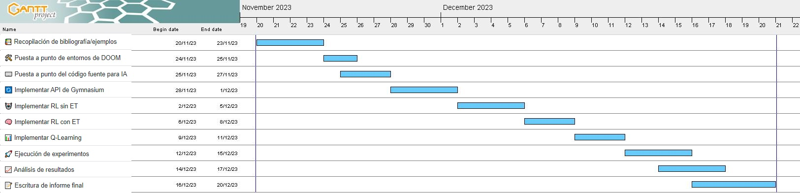

# Inteligencia Artificial aprende a jugar DOOM

# DOOM-Master

## Descripción: 

El proyecto tiene como objetivo diseñar un agente de inteligencia artificial (IA) capaz de aprender a jugar el videojuego DOOM utilizando técnicas de aprendizaje por refuerzo (Reinforcement Learning) y Eligibility Traces. Se utilizará una biblioteca de GitHub que proporciona entornos virtuales de DOOM, junto con la API de Gymnasium para aplicar filtros al entorno y así el agente podrá aprender a identificar enemigos. El proyecto busca evaluar qué tan rápido y eficientemente el agente puede aprender a jugar el juego y lograr sus objetivos.

### Objetivos:

- Diseñar un agente de IA capaz de aprender a jugar DOOM utilizando Reinforcement Learning con y sin Eligibility Traces.
- Evaluar el rendimiento del agente en términos de cantidad de iteraciones para aprender jugar maximizando puntaje de manera eficiente, puntaje obtenido en los distintos entornos.
- Validar la eficacia de la combinación de Reinforcement Learning y Eligibility Traces para mejorar el rendimiento del agente en un entorno de juego complejo como DOOM.

### Justificación: 
- Complejidad del problema: DOOM es un videojuego con un entorno virtual complejo y dinámico que presenta desafíos significativos para el aprendizaje de agentes. La toma de decisiones en tiempo real, la navegación, la detección de objetos y la interacción con el entorno requieren un enfoque avanzado.

- Eficiencia computacional: Los algoritmos de Deep RL, aunque poderosos, a menudo requieren una gran capacidad de procesamiento y recursos de hardware, como GPUs o TPUs, para un entrenamiento eficiente. En comparación, el uso de RL con Eligibility Traces suele ser más eficiente en términos de recursos computacionales, lo que lo hace más adecuado para máquinas de hogar con recursos limitados.

- Implementación más sencilla: Los algoritmos de RL con Eligibility Traces tienden a ser más simples de implementar en comparación con los complejos modelos de redes neuronales utilizados en Deep RL. Esto hace que la implementación sea más accesible y práctica.

### Alcance:
El proyecto se enfoca en el desarrollo de un agente de IA para jugar el videojuego DOOM utilizando las técnicas mencionadas. El alcance incluye la implementación de los algoritmos de Reinforcement Learning con y sin Eligibility Traces, así como la integración de la API de Gymnasium para la detección de objetos. Se llevarán a cabo experimentos para validar el rendimiento del agente y se analizarán los resultados.

### Limitaciones:

El proyecto se limita a la utilización de entornos virtuales de DOOM y no aborda otros videojuegos.
La evaluación del agente se centrará en métricas relacionadas con su rendimiento en DOOM y no se extenderá a aplicaciones en otros dominios.
Las actividades propuestas pueden estar sujetas a modificaciones y mejoras a medida que avance el proyecto.

### Forma de Evaluación (Métricas de Resultados):
##### Se evaluará el proyecto en función de las siguientes métricas:

- Cantidad de ejecuciones: Se medirá la cantidad de ejecuciones, veces que el agente necesita entrenarse en el entorno, para que el agente pueda jugar en ese entorno de manera efectiva, comparando cantidad de ejecuciones / puntaje obtenido.

- Rendimiento en términos de puntajes o logros dentro del juego: Se medirá el éxito del agente en comparación con otros agentes. Dependiendo el entorno se tendrá distintos objetivos.

- Entornos de entrenamiento:
    - **Basic:** Escenario rectangular, con un enemigo inmovil en alguna parte. *Objetivo*: matar al enemigo, en la menor cantidad de movimientos.
    - **Defend the Line:** Escenario rectangular, varios enemigos acercandosé y disparando al agente. *Objetivo* matar la mayor cantidad de enemigos antes de morir. 
- Entorno de Evaluación: 
    - **Defend the Center:** Escenario circular varios enemigos acercandosé y disparando al agente desde posiciones distintas. *Objetivo* matar la mayor cantidad de enemigos antes de morir.

#### Actividades a Realizar:

Act 1. 📚 Recopilación de bibliografía/ejemplos del problema a resolver. [4 días]

Act 2. 🛠️ Puesta a punto de entornos de DOOM con control del jugador de manera random. [2 días]

Act 3. ⌨️ Puesta a punto del código fuente para IA de RL. [3 días]

Act 4. 🔄 Implementar API de Gymnasium para aplicar filtros al renderizado. [4 días]

Act 5. 🤖 Implementación de Reinforcement Learning sin Eligibility Traces. [4 días]

Act 6. 🧠 Implementación de Reinforcement Learning con Eligibility Traces. [3 días]

Act 7. 📊 Implementación de Q-Learning [3 días]

Act 8. 🚀 Ejecución de los experimentos a fin de validar el objetivo y obtener resultados. [4 días]

Act 9. 📈 Análisis de los resultados. [4 días]

Act 10. 📝 Escritura de informe final. [5 días]

### Referencias:

- [Eligibility Traces in Reinforcement Learning](https://towardsdatascience.com/eligibility-traces-in-reinforcement-learning-a6b458c019d6)
- [Video: Reinforcement Learning with Eligibility Traces](https://www.youtube.com/watch?v=oinIaLIM5bw)
- [Video: Reinforcement Learning with Eligibility Traces (2)](https://www.youtube.com/watch?v=xc0IwNI3NHU)
- [Reinforcement Learning with Eligibility Traces: A Survey](https://link.springer.com/article/10.1023/A:1018012322525)
- [TD in Reinforcement Learning: The Easy Way](https://towardsdatascience.com/td-in-reinforcement-learning-the-easy-way-f92ecfa9f3ce)
- [Monte Carlo in Reinforcement Learning: The Easy Way](https://zsalloum.medium.com/monte-carlo-in-reinforcement-learning-the-easy-way-564c53010511)
- [ViZDoom GitHub Repository](https://github.com/Farama-Foundation/ViZDoom)
- [Stable Baselines Documentation](https://stable-baselines.readthedocs.io/en/master/)
- [Gymnasium GitHub Repository](https://github.com/Farama-Foundation/Gymnasium)

## Proyectos Similares
- [Deep Reinforcement Learning agents that play different Doom scenarios](https://github.com/emasquil/doom-rl)
- [A deep reinforcement learning agent playing DOOM ](https://www.researchgate.net/publication/318283732_Clyde_A_deep_reinforcement_learning_DOOM_playing_agent)
- [Playing Doom with an AI](https://www.linkedin.com/pulse/playing-doom-ai-s%C3%A9rgio-saraiva/)
- [Playing DOOM with Deep Reinforcement Learning](https://medium.com/@james.liangyy/playing-doom-with-deep-reinforcement-learning-e55ce84e2930)
- [Deep Learning – Training an AI to Play Doom](https://www.codeproject.com/Articles/1232713/Deep-Learning-Training-an-AI-to-Play-Doom)
- [Build a Doom AI Model with Python - Youtube](https://www.youtube.com/watch?v=eBCU-tqLGfQ)