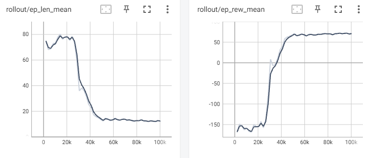
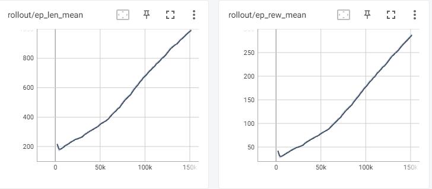
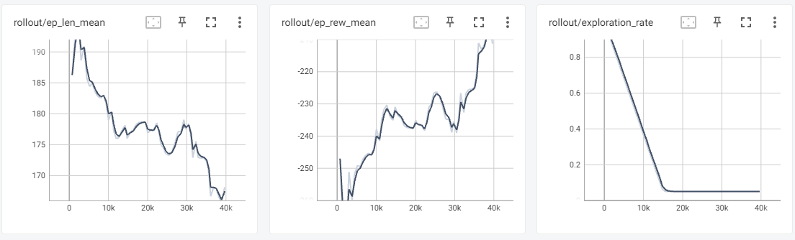

## 
 Proyecto Final 

# 
 Inteligencia Artificial 

# 
 DOOM Master 

### Introducción 

El proyecto tiene como objetivo comparar distintas tecnicas de Reinforcment Learning para aprender a jugar el videojuego DOOM, con el fin de evaluar la velocidad y eficiencia con la que el agente puede aprender y maximizar su puntaje. Se abordardó el uso de técnicas como Q-Learning y PPO (Proximal Policy Optimization) A2C. AAlgunos de los desafíos encontrados se deben a la complejidad inherente de un videojuego, lo que también complejizó la creación de entornos de juego, compatibles con algoritmos de aprendizaje. Dada esta complejidad y el hecho de que el agente debe tomar decisiones en tiempo real, navegar por el entorno y reconocer objetos, se justifica la aplicación de técnicas de inteligencia artificial para resolver este problema.

El juego de DOOM, en este caso, consta de 3 escenarios, la idea principal del juego es matar a todos los enemigos y sobrevivir lo maximo posible, para ello contamos con una pistola, balas, y un porcentaje de salud. Las acciones disponibles dependera del escenario, pero el agente podra o moverse o rotar a la izquierda o derecha y disparar.

Para llevar a cabo este proyecto, se utilizó una biblioteca disponible en GitHub que proporciona entornos virtuales de DOOM. Se combinó con la API de Gymnasium y se emplearon librerías como cv2 para aplicar filtros de color a la imagen. El objetivo principal del proyecto es evaluar la velocidad y eficiencia con la que el agente puede aprender a jugar el juego y alcanzar sus objetivos.

El informe se encuentra organizado de la siguiente manera. Primero se plantea que algoritmos se utilizaron y porque se eligieron. Despues en la parte de Diseño experimental se entra en detalle sobre cada uno de los escenarios y los resultados obtenidos por los agentes. Una vez termianada la fase experimental se analizan los resultados contrastando con las graficas y tablas. Por ultima se expone una conclusion del trabajo donde se abordan temas que quedaron pendientes, experimentos que se podrian haber probado y un cierre del proyecto.

----

### Marco teórico

En esta sección, se brindará una descripción teórica general del funcionamiento de los algoritmos de Reinforcement Learning seleccionados: Q-Learning y PPO (Proximal Policy Optimization). Se explicarán sus principales elementos y la razón detrás de la elección de cada algoritmo para abordar el problema planteado.

#### Algoritmos Utilizados

#### Q-Learning:

Q-Learning es un algoritmo de aprendizaje por refuerzo que se basa en la idea de aprender valores de calidad (Q-values) para cada par estado-acción. La idea fundamental es que el agente toma decisiones óptimas seleccionando la acción con el valor Q más alto para un estado dado. Al principio el algoritmo tiene un gran porcentaje de acciones random, o tambien conocido como etapa de exploración, donde se empieza a armar los Q-values. [9] [7]

La fórmula fundamental para actualizar estos valores \(Q\) se expresa de la siguiente manera:
$`
Q(s, a) \leftarrow Q(s, a) + \alpha \cdot \left( r + \gamma \cdot \max_{a'} Q(s', a') - Q(s, a) \right)
`$

Donde:

- $`Q(s, a)`$ representa el valor de calidad (Q-value) para el estado \(s\) y la acción \(a\).
- $`\alpha`$ es la tasa de aprendizaje que controla la rapidez con la que el agente actualiza sus estimaciones.
- $`r`$ es la recompensa obtenida al realizar la acción \(a\) en el estado \(s\).
- $`\gamma`$ es el factor de descuento que pondera la importancia de las recompensas futuras.
- $`s'`$ es el siguiente estado después de tomar la acción \(a\) en el estado \(s\).
- $`a'`$ es la acción óptima en el siguiente estado \(s'\).

La actualización de $`Q(s, a)`$ se basa en la diferencia entre la recompensa inmediata $`(r)`$ y la recompensa esperada en el próximo estado ponderada por $`\gamma`$, que a su vez se maximiza con respecto a todas las posibles acciones $`a'`$ en el próximo estado $`s'`$. Este proceso de actualización se repite a lo largo de las interacciones del agente con el entorno, permitiéndole mejorar progresivamente sus estimaciones de los valores $`Q`$ para tomar decisiones más informadas y maximizar las recompensas esperadas.

En el contexto de DOOM, el agente estaría en un estado particular del juego, representado como array de (160x160x1) height, weigth, channel o dimmension, de la imagen capturada de la pantalla del juego en ese instante. Q-Learning actualizaría los valores Q para cada par estado-acción en función de las recompensas obtenidas al realizar acciones en ese estado.

**Justificación de la Elección:**

Q-Learning es elegido como un algoritmo de referencia para comparación debido a su simplicidad, pero dado que el entorno donde se encuentra es muy complejo se espera que no obtenga muy buenos resultados.

&nbsp;
&nbsp;

#### PPO (Proximal Policy Optimization)

**Descripción Teórica:**

El algoritmo Proximal Policy Optimization (PPO) es un método de aprendizaje por refuerzo que pertenece a la categoría de algoritmos basados en políticas. Se utiliza para entrenar agentes en entornos de toma de decisiones bajo incertidumbre. Su enfoque radica en mejorar de manera gradual y controlada una política de acción existente. [3] [1]

Una de las características clave de PPO es su estrategia para restringir los cambios entre las políticas antiguas y nuevas, gracias a su funcion de optimización que mide que tanto cambia la politica antigua vs la politica nueva, cortando y restringiendo los cambios bruscos de politicas, lo que contribuye a garantizar la estabilidad durante el proceso de entrenamiento.[10] [11]

En el contexto de DOOM, PPO utiliza redes neuronales convolucionales (CNN) para procesar las imágenes del juego y aprender una política que optimice la secuencia de acciones para maximizar las recompensas.

Las Redes Neuronales Convolucionales (CNN) son un tipo de red neuronal especialmente diseñada para procesar datos con una estructura en forma de cuadrícula, como imágenes. Utilizan capas convolucionales para aprender automáticamente patrones y características en los datos de entrada. [12]

Las capas convolucionales aplican filtros a regiones locales de los datos de entrada para extraer características significativas. Durante el proceso de convolución, los filtros aprenden a reconocer patrones y características simples, como bordes, texturas o formas, en regiones específicas de la entrada. A medida que se agregan más capas convolucionales, la red neuronal puede capturar características más abstractas y complejas.

**Justificación de la Elección:**

PPO es seleccionado por su capacidad para trabajar con espacios de acciones continuos y grandes espacios de observación. A través de su naturaleza de actualización local y su enfoque en la estabilidad, se adapta bien a entornos complejos como DOOM, donde las observaciones son imágenes.

Implementación tomada de la libreria de Stable Baselines 3 [1]

&nbsp;
&nbsp;

#### DQN (Deep Q-Network)

DQN es un algoritmo de aprendizaje por refuerzo que utiliza redes neuronales profundas para aproximar la función Q en el aprendizaje Q-Learning. [1]

Elementos de DQN:

**Replay Memory:** Para evitar la correlación entre las transiciones ( evitar cierta dependencia o similitud entre estado/acción/recompensa/estado resultante) de los datos de entrenamiento, DQN almacena experiencias pasadas en una memoria de reproducción. Esto permite al algoritmo realizar un muestreo aleatorio de estas experiencias durante el entrenamiento, lo que estabiliza y mejora la convergencia del modelo. [13]

**Target Network:** Para hacer que el entrenamiento sea más estable, DQN emplea dos redes neuronales: una red principal (la DNN) y una red objetivo (target network). La red objetivo se actualiza periódicamente con los pesos de la red principal, lo que suaviza las actualizaciones y hace que el entrenamiento sea más estable. [14]

**Gradien Clipping:** Consiste en limitar la magnitud de los gradientes si estos superan un cierto umbral predefinido. Esto se hace para evitar que los gradientes sean muy grandes, lo que puede llevar a problemas durante el entrenamiento, como la inestabilidad numérica o la explosión del gradiente. [14]

**Justificación de la elección:**

La elección de DQN se justifica gracias a su capacidad de lidiar con complejidades mayores que Q-Learning, como el caso de los entornos de DOOM. Esto permitiria a DQN comprender mejor el entorno y asi poder obtener mejores resultados.

Implementación tomada de la libreria de Stable Baselines 3 [1]

---

### Diseño Experimental

#### Entornos Virtuales de DOOM

Para la creación de los entornos virtuales de DOOM se utilizo la libreria "ViZDoom" [2], creada y pensanda para desarrollar agentes de Inteligencia Artificial utilizando unicamente la información visual. Esta libreria contiene entornos de entrenamiento con ciertas pautas, para enseñar al agente distintas cosas en cada uno. 

<u>Los entornos que se utilizaron fueron:</u>

- 
<b>Basic: (Entrenamiento)</b>
 Este entorno cuenta con un escenerio cuadrado, con un solo enemigo posicionado de manera aleatoria sobre el entorno, y al agente posicionado en el medio de escenario. La idea de este entorno es enseñar al agente a identificar al enemigo, y dispararle lo mas rapido posible. 

    - En este escenario las posibles acciones son, <u><b>Moverse Izquierda, Moverse Derecha, Disparar. </b></u>
    - Los incentivos en este escenario son:
        - -1.2 por cada accion que realiza el agente, 
        - -5 por cada disparo, 
        - +106 por matar al enemigo. 

    Ademas este escenario fue modificado para cuando el enemigo apareciera muy cercano al centro, el escenario se reiniciara hasta que el enemigo estuviera mas alejado.

    **Esquema del mapa:**

    

  
    
<b>Figura 1:</b> Escenario Basic. (El agente en verde, y en el cuadrado rojo el enemigo)
 

 

&nbsp;

<b>Renderizado del juego:</b>

    

  
    

    
<b>Figura 2:</b> Visualización del juego en modo jugador
 

&nbsp;

<b>Renderizado que se envia al agente:</b>

    

  

    
<b>Figura 3:</b> Imagen recortada y con filtro de escala de grises

    Se envia como un variable Box de dimensiones (120,160,1) (altura, ancho, canales o dimensiones)  

&nbsp;

<b>Comparación entre el renderizado del juego y el renederizado que se envia al agente:</b>

    

  

    
<b>Figura 4:</b> Comparación entre la imagen que se le envia al agente a una resolución mucho menor para que el procesamiento sea mas rapido y facil vs la visualización nativa.

 

&nbsp;
&nbsp;

- 
<b>Defend the Line: (Entrenamiento)</b>
 Este escenario cuenta con 3 enemigos que se acercan al agente que se encuentra inmovil, cada vez que un enemigo muere, reaparece con mas vida despues de unos segundos. Este entorno tiene como objetivo enseñar al agente a mantenerse vivo lo maximo posible, ya que el agente cuenta con balas infinitas. 

    - Las posibles acciones son, <u><b>Rotar Izquierda, Rotar Derecha, Disparar. </b></u>
    - Los incentivos en este escenario son:
        - -9 por cada disparo que no acierta sonbre un enemigo.
        - +10 por matar a un enemigo.

    Este entorno tambien fue modificado para ajustarse al objetivo de aprendizaje.
    
    **Esquema del mapa:**

  
    
<b>Figura 5:</b> Escenario Defend the Line. (El agente en verde, y en los cuadrados rojos los enemigos)
 

 

&nbsp;

<b>Renderizado del juego:</b>

    

  
    

    
<b>Figura 6:</b> Visualización del juego en modo jugador
 

&nbsp;

<b>Renderizado que se envia al agente:</b>

    

  

    
<b>Figura 7:</b> Imagen recortada y con filtro de escala de grises

    Se envia como un variable Box de dimensiones (120,160,1) (altura, ancho, canales o dimensiones) 
 

&nbsp;

<b>Comparación entre el renderizado del juego y el renederizado que se envia al agente:</b>

    

  

    
<b>Figura 8:</b> Comparación entre la imagen que se le envia al agente a una resolución mucho menor para que el procesamiento sea mas rapido y facil vs la visualización nativa.

 

&nbsp;
&nbsp;

- 
<b>Defend the Center:</b>
 Este escenario cuenta con un entorno circular, donde los enemigos se acercan al agente desde 4 direcciones, de las cuales el agente solo puede ver 1 si se queda quieto. El objetivo de este escenario es evaluar que tan bien ha aprendido el agente en los escenarios anterioires.  

    - Las posibles acciones son, <u><b>Rotar Izquierda, Rotar Derecha, Disparar. </b></u>
    - Los incentivos en este escenario son:
        - +1 por matar a un enemigo. 
        - -1 por morir.

    **Esquema del mapa:**

  
    
<b>Figura 9:</b> Escenario Defend the Center. (El agente en verde, y en los cuadrados rojos los enemigos)
 

 

&nbsp;

<b>Renderizado del juego:</b>

    

  
    

    
<b>Figura 10:</b> Visualización del juego en modo jugador
 

&nbsp;

<b>Renderizado que se envia al agente:</b>

    

  

    
<b>Figura 11:</b> Imagen recortada y con filtro de escala de grises

    Se envia como un variable Box de dimensiones (120,160,1) (altura, ancho, canales o dimensiones) 
 

&nbsp;

<b>Comparación entre el renderizado del juego y el renederizado que se envia al agente:</b>

    

  

    
<b>Figura 12:</b> Comparación entre la imagen que se le envia al agente a una resolución mucho menor para que el procesamiento sea mas rapido y facil vs la visualización nativa. 

 

&nbsp;
&nbsp;

**La forma en que se evaluo y analizaron los resultados fueron las siguientes:**

Cada algoritmo se corrio por al menos **100.000** iteraciones sobre cada entorno de entrenamiento (basic y defend the line), en el cual se guardo un estado del aprendizaje cada **20.000** iteraciones.
Una vez entrenado cada algoritmo se evaluo su puntaje medio en 30 episodios en los 3 escenarios, en cada etapa (20,40,60,80,100) a fin de evaluar que tan bien aprendio cada algoritmo, alrededor de cuantas iteraciones le tomo aprender lo que se le queria enseñar en el escenario y su resultado sobre el escenario de evaluación.

Las metricas son <u>Promedio de rewards</u> sobre las 30 iteraciones, <u>Desviacion estandar de las rewards</u>, <u>Promedio duracion episodio</u> hasta que se corta, muere o cumple el objetivo, <u>Desviacion estandar duracion episodio</u>

Glosario de Paramentros:
- Policy: La politica del modelo a usar (MlpPolicy, CnnPolicy) [3]
- learning_rate: Hiperparametro que controla cuanto cambia el modelo en respuesta del error estimado, cada vez que los pesos son actualizados. [17]
- batch_size: Número de muestras que son pasadas al modelo a la vez. [18]
- buffer_size: Tamaño del buffer para almacenar experiencias pasadas. [14]
- exploration_fraction: Porcentaje de episodios donde la exploración disminuira.
- epsilon_start: Probabilidad inicial de acciones random.
- epsilon_end: Probabilidad final de acciones random.
- epsilon_decay_episodes: Cantidad de episodios donde epsilon decaera hasta epsilon_end.
- discount_factor o gamma = Factor de descuento para las recompensas futuras. [9]

#### Q-Learning

**Basic**
Parametros: epsilon_start = 0.88, epsilon_end = 0.1, epsilon_decay_episodes = 20000,discount_factor = 0.9, learning_rate = 0.85

Resultados de 30 iteraciones sobre el escenario Basic, despues de N iteraciones de entrenamiento.

| Iteraciones de entrenamiento (N)| Promedio rewards | Desviacion estandar rewards | Promedio duracion episodio | Desviacion estandar duracion episodio |
|------------------------------|------------------|-----------------------------|---------------------------|---------------------------------------|
| 20k              | -161.27          | 117.33       | 40.0     | 14.29   |
| 40k              | -299.67          | 10.33        | 48.33    | 1.67    |
| 60k              | -179.57          | 155.83       | 36.53    | 18.32   |
| 80k              | -51.79           | 127.36       | 23.9     | 16.76   |
| 100k             | -176.88          | 152.83       | 36.73    | 18.08   |

<b>Tabla 1</b>

&nbsp;

**Defend the Line**
Resultados de 30 iteraciones sobre el escenario Defend the Line, despues de N iteraciones de entrenamiento.

|Iteraciones de entrenamiento (N)| Promedio rewards | Desviacion estandar rewards | Promedio duracion episodio | Desviacion estandar duracion episodio |
|----------------------------|------------------|-----------------------------|-------------------|---------------------------------------|
|20.000|
|40.000|
|60.000| | | | |
|80.000| |  |  | |
|100.000| |  |  | |

<b>Tabla 2</b>

- 20k
- 40k
- 60k
- 80k
- 100k
&nbsp;

**Defend the Center**
Resultados de 30 iteraciones sobre el escenario Defend the Center, despues de N iteraciones de entrenamiento sobre los escenarios Basic y Defend the Line.

| Iteraciones de entrenamiento (N)| Promedio rewards | Desviacion estandar rewards | Promedio duracion episodio | Desviacion estandar duracion episodio |
|----------------------------|------------------|-----------------------------|-------------------|---------------------------------------|
|20.000|
|40.000|
|60.000| | | | |
|80.000| |  |  | |
|100.000| |  |  | |

<b>Tabla 3</b>

- 20k
- 40k
- 60k
- 80k
- 100k

&nbsp;
#### PPO

**Basic**
Parametros: Policy: "CnnPolicy", learning_rate=0.00027, batch_size=64

<b>Figura 13:</b> Media duracion del episodio y Media puntuacion del episodio (eje Y) sobre cantidad de iteraciones (eje X), en fase de entrenamiento.

&nbsp;

Resultados de 30 iteraciones sobre el escenario Basic, despues de N iteraciones de entrenamiento.

 Iteraciones de entrenamiento (N)| Promedio rewards | Desviacion estandar rewards | Promedio duracion episodio | Desviacion estandar duracion episodio |
|----------------------------|------------------|-----------------------------|-------------------|---------------------------------------|
|20.000|-164.16| 118.60|158.0| 62.10|
|40.000|33.74|82.46|44.3|43.24|
|60.000|50.07|36.25|36.3|23.67|
|80.000|63.6| 8.47|26.8 |6.3|
|100.000|63.99|11.07 | 27.2|7.79|

<b>Tabla 4</b>

&nbsp;

**Defend the Line**

<b>Figura 14:</b> Media duracion del episodio y Media puntuacion del episodio (eje Y) sobre cantidad de iteraciones (eje X), en fase de entrenamiento.

&nbsp;

Resultados de 30 iteraciones sobre el escenario Defend the Line, despues de N iteraciones de entrenamiento.
| Iteraciones de entrenamiento (N)| Promedio rewards | Desviacion estandar rewards | Promedio duracion episodio | Desviacion estandar duracion episodio |
|------------------------------|------------------|-----------------------------|---------------------------|---------------------------------------|
| 20k                          | 117.36           | 34.34      | 463.53  | 130.40  |
| 40k                          | 281.02           | 59.46      | 997.83  | 239.71  |
| 60k                          | 270.69           | 53.62      | 942.97  | 212.03  |
| 80k                          | 348.68           | 50.58      | 1165.13 | 201.40  |
| 100k                         | 344.68           | 55.47      | 1181.23 | 229.91  |

<b>Tabla 5</b>

&nbsp;

**Defend the Center**
Resultados de 30 iteraciones sobre el escenario Defend the Center, despues de N iteraciones de entrenamiento sobre los escenarios Basic y Defend the Line.

| Iteraciones de entrenamiento (N)| Promedio rewards | Desviacion estandar rewards | Promedio duracion episodio | Desviacion estandar duracion episodio |
|------------------------------|------------------|-----------------------------|---------------------------|---------------------------------------|
| 20k                          | 4.13             | 3.53          | 272.0   | 120.23  |
| 40k                          | 1.37             | 1.59          | 163.6   | 53.01   |
| 60k                          | 2.27             | 2.37          | 196.7   | 70.79   |
| 80k                          | 3.27             | 2.63          | 228.57  | 83.22   |
| 100k                         | 2.13             | 1.43          | 197.73  | 38.67   |
| 140k                         | 0.63             | 1.09          | 157.6   | 35.30   |

<b>Tabla 6</b>

&nbsp;

### DQN 
**Basic**
Parametros: policy="CnnPolicy", batch_size=64, buffer_size=400000, exploration_fraction=0.15

<b>Figura 15:</b> Media duracion del episodio, Media puntuacion del episodio, Ratio de Exploración (eje Y) sobre cantidad de iteraciones (eje X), en fase de entrenamiento.

&nbsp;

Resultados de 30 iteraciones sobre el escenario Basic, despues de N iteraciones de entrenamiento.
| Iteraciones de entrenamiento (N)| Promedio rewards | Desviacion estandar rewards | Promedio duracion episodio | Desviacion estandar duracion episodio |
|-----------------------------|------------------|-----------------------------|---------------------------|---------------------------------------|
| 20.000                      | -175.07          | 130.16         | 158.03 | 70.43 |
| 40.000                      | -185.01          | 123.22         | 162.40 | 65.90 |
| 60.000                      | -225.44          | 72.11          | 184.03 | 36.28 |
| 80.000                      | -197.95          | 101.15         | 171.77 | 50.15 |
| 100.000                     | -188.38          | 121.74         | 164.23 | 64.06 |

<b>Tabla 7</b>

&nbsp;

**Defend the Line**
Resultados de 30 iteraciones sobre el escenario Defend the Line, despues de N iteraciones de entrenamiento.
| Iteraciones de entrenamiento (N)| Promedio rewards | Desviacion estandar rewards | Promedio duracion episodio | Desviacion estandar duracion episodio |
|----------------------------|------------------|-----------------------------|-------------------|---------------------------------------|
|20.000|
|40.000|
|60.000| | | | |
|80.000| |  |  | |
|100.000| |  |  | |

<b>Tabla 8</b>

- 20k
- 40k
- 60k
- 80k
- 100k

&nbsp;

**Defend the Center**
Resultados de 30 iteraciones sobre el escenario Defend the Center, despues de N iteraciones de entrenamiento sobre los escenarios Basic y Defend the Line.

| Iteraciones de entrenamiento (N)| Promedio rewards | Desviacion estandar rewards | Promedio duracion episodio | Desviacion estandar duracion episodio |
|----------------------------|------------------|-----------------------------|-------------------|---------------------------------------|
|20.000|
|40.000|
|60.000| | | | |
|80.000| |  |  | |
|100.000| |  |  | |

<b>Tabla 9</b>

- 20k
- 40k
- 60k
- 80k
- 100k

&nbsp;

#### Promedio de Rewards con entrenamiento de 100.000 iteraciones
|Algoritmo | Basic | Defend the Line | Defend the Center|
|----------|-------|-----------------|------------------|
|Q-Learning|-176.88| | |
|DQN       |-188.38| | |
|PPO       | 63.99 | 344.68 | 2.13|

<b>Tabla 10</b>

#### Comparacion DQN vs Q-Learning
**Basic**
En el escenario Basic sobre 100.000 iteraciones de entrenamiento.
| Algoritmo| Promedio rewards | Desviacion estandar rewards | Promedio duracion episodio | Desviacion estandar duracion episodio |
|-----------------------------|------------------|-----------------------------|---------------------------|---------------------------------------|
| Q-Learning |-176.88          | 152.83       | 36.73    | 18.08   |
| DQN        |-188.38          | 121.74         | 164.23 | 64.06 |

<b>Tabla 11</b>

&nbsp;

**Defend the Line**
En el escenario Defend the Line sobre 100.000 iteraciones de entrenamiento.
| Algoritmo| Promedio rewards | Desviacion estandar rewards | Promedio duracion episodio | Desviacion estandar duracion episodio |
|-----------------------------|------------------|-----------------------------|---------------------------|---------------------------------------|
| Q-Learning |
| DQN        | 

<b>Tabla 12</b>

---

### Análisis y discusión de resultados

En esta sección se deberá realizar un mínimo análisis sobre los resultados obtenidos. El objetivo es tratar de razonar sobre las causas de los resultados obtenidos en la fase experimental a fin de proveer una posible justificación. Aquí se incluyen posibles limitaciones en los algoritmos elegidos, en la simulación planteada, los datos, etc.

#### PPO
A partir de los resultados obtenidos en Basic, se puede observar la gran eficiencia de este algoritmo, que en 40.000 iteraciones pudo identificar al enemigo. (Tabla 4 y Figura 13)

En base a los resultados obtenidos del algoritmo en el escenario de testeo (Defend the Center), se puede observar que a mayor entrenamiento en Defend the Line, peores resultados obtenia. Esto puede deberse a que en Defend the Line se prioriza apuntar a lo primero que se ve y a lo más cercano. Una vez que ese enemigo muere, pasa al siguiente. En cambio en Defend the Center, los enemigos empiezan muy lejos, lo que dificulta el apuntado, y con 1 solo enemigo en el campo de vision del agente. Además, en el escenario hay enemigos más rápidos que otros, por lo que si el agente se queda apuntando a un enemigo lejano que es más lento, los demás enemigos más rápidos empezarán a dañar al agente. Este comportamiento se ve más pronunciado mientras más se entrenó al agente sobre Defend the Line.

#### Q-Learning
En base a los resultados y a una observación del comportamiento del agente en el escenario Basic, se observó que el algoritmo encontró el rango donde con mas frecuencia se encuentra el enemigo. En la iteracion 100.000 el agente se mueve en un rango de izquierda a derecha bastante amplio pero en ningun caso llega al final del escenario, y dispara mientras se mueve, por lo que podemos deducir que aprendio el rango con mayor probabilidad de aparacion del enemigo, el problema es que al disparar constantemente mientras se mueve pierde mucho puntaje. En conclusion el algoritmo fue incapaz de detectar el enemigo en 100.000 iteraciones.

(Falta entrenamiento sobre Defend the Line y resultados finales)

#### DQN
Analizando los datos obtenidos del entrenamiento sobre el entorno Basic, y viendo el comportamiento en el juego, se puede concluir que en la iteracion 100.000 no solo no reconocio al enemigo, sino que es peor que el Q-Learning (Tabla 11), ya que el patron que encontró, es desde la pared izquierda y unos pocos pasos a la derecha de la misma, donde la probabilidad del enemigo de aparecer por esa zona esta por encima de la media, pero no lo suficiente como para obtener buenos resultados. (Tabla 7 y Figura 15)

En las iteraciones anteriores, por ejemplo en la 20.000 se obserba como el agente unicamente se mueve a la izquierda y dispara, pero si el enemigo se encuentra a la derecha el agente lo "ignora". En cambio en la iteracion 40.000 unicamente se mueve hacia la derecha, obteniendo unos resultados muy similares.

(Falta entrenamiento sobre Defend the Line y resultados finales)

--- 

### Conclusiones finales

Debido a una falta de tiempo, de conocimientos y de complejidad del proyecto, no se pudo realizar la comparación de algoritmos con y sin Eligibility Traces. La adaptacion de estos algoritmos a un entorno tan comlejo y personalizado se dificultó demasiado. La idea era poder observar si esta caracteristica de actualización de la política es beneficiosa en apliaciones de entrenamiento de agentes para aprender a jugar videojugos o apliaciones similares. 

Algunos experimetos que se podria haber probado, sin mucha modificacion sobre lo ya implemtado son:
Se podria haber experimentado mas con Q-Learning, dando una ventana de exploración mas amplia, y dejandolo correr por mas iteraciones, para observar si el algoritmo es capaz de aprender a identificar al enemigo o no.

Una alternativa sería plantear una modificación sobre el segundo escenario, Defend the Line, para priorizar el apuntado, penalizando más si se falla al disparar, para observar si el comportamiento sobre el ultimo escenario es mejor o no, buscando que priorice enemigos mas cercanos donde el apuntado es más facil.

En conclusion, aunque se podria seguir experimentando, agregando mas algoritmos o realizando modificaciones a los ya implementados, se puede observar una clara ventaja de los algoritmos de Deep Reinforcement Learning como PPO sobre un algoritmo mas simple como Q-Learning. Donde PPO identificó al enemigo de manera muy rapida, alrededor de 40.000 iteraciones, Q-Learning en 100.000 iteraciones no pudo.

---

### Bibliografía

[1] [Stable-Baselines3](https://stable-baselines3.readthedocs.io/en/master/index.html) - Reliable Reinforcement Learning Implementations. 

[2] [ViZDoom Documentation](https://vizdoom.farama.org/) - Library for developing AI bots that play Doom using visual information.

[3] [PPO](https://stable-baselines3.readthedocs.io/en/master/modules/ppo.html#ppo-policies) - Proximal Policy Optimization algorithm.

[4] [DQN](https://stable-baselines3.readthedocs.io/en/master/modules/dqn.html) - Deep Q Network.

[5] [Doom AI Model with Python](https://www.youtube.com/watch?v=eBCU-tqLGfQ)

[6] [OpenCV](https://www.geeksforgeeks.org/opencv-python-tutorial/?ref=lbp) - Open-source library for computer vision, machine learning, and image processing.

[7] [Q-Learning Algorithm Form Scratch](https://www.youtube.com/watch?v=-LD1Fj76bQg) 

[8] [Notebook](https://colab.research.google.com/drive/1E2RViy7xmor0mhqskZV14_NUj2jMpJz3#scrollTo=X25vn4VKw2as) on Q-Learning implementation on Python.

[9] [Q-Learning Algorithm: From Explanation to Implementation](https://towardsdatascience.com/q-learning-algorithm-from-explanation-to-implementation-cdbeda2ea187)

[10] [The intuition behind PPO - Hugging Face](https://huggingface.co/learn/deep-rl-course/unit8/intuition-behind-ppo)

[11] [Proximal Policy Optimization Explained](https://www.youtube.com/watch?v=HrapVFNBN64)

[12] [¿Qué son las redes neuronales convolucionales? - IBM](https://www.ibm.com/es-es/topics/convolutional-neural-networks)

[13] [How To Think About Replay Memory](https://jacobbuckman.com/2021-02-13-how-to-think-about-replay-memory/#:~:text=The%20replay%20memory%2C%20or%20replay,update%20on%20them%20multiple%20times.)

[14] [Q-Learning vs. Deep Q-Learning vs. Deep Q-Network](https://www.baeldung.com/cs/q-learning-vs-deep-q-learning-vs-deep-q-network)

[15] [TensorBoard](https://www.tensorflow.org/tensorboard/get_started?hl=es-419) from TensorFlow - Para graficos del entrenamiento de los modelos.

[16] [Pytorch](https://pytorch.org/) - Optimized tensor library for deep learning using GPUs and CPUs.

[17] [Understand the Impact of Learning Rate on Neural Network Performance](https://machinelearningmastery.com/understand-the-dynamics-of-learning-rate-on-deep-learning-neural-networks/)

[18] [Deep Learning Fundamentals - Classic Edition](https://deeplizard.com/learn/video/U4WB9p6ODjM)

### Citas

M. Kempka, M. Wydmuch, G. Runc, J. Toczek & W. Jaśkowski, ViZDoom: A Doom-based AI Research Platform for Visual Reinforcement Learning, IEEE Conference on Computational Intelligence and Games, pp. 341-348, Santorini, Greece, 2016	([arXiv:1605.02097](http://arxiv.org/abs/1605.02097))

Antonin Raffin, Ashley Hill, Adam Gleave, Anssi Kanervisto, Maximilian Ernestus, Noah Dormann; Stable-Baselines3: Reliable Reinforcement Learning Implementations, Journal of Machine Learning Research, 2021, ([paper](http://jmlr.org/papers/v22/20-1364.html)).