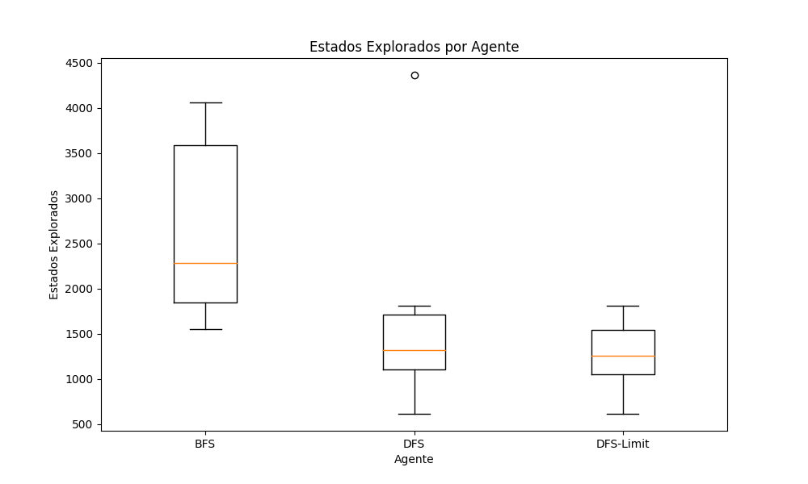

# Trabajo Práctico 3: Búsqueda no informada

Ejecutar un total de 30 veces cada algoritmo en un escenario aleatorio con una tasa de obstáculos del 8 por ciento, calcular la media y la desviación estándar de la cantidad de estados explorados para llegar al destino (si es que fue posible).

| Agente           | Estados Explorados en Promedio | Desviación Estándar |
|------------------|--------------------------------|---------------------|
| BFSAgent         | 2678.14                        | 476,85             |
| DFSAgent         | 1702.14                        | 562.58             |
| DFSLimitAgent         | 1258.67                         | 177.95             |

### Porcentaje de Entornos Resueltos
+ Porcentaje de veces que **BFSAgent** encontró la solución: 23,3.00%
+ Porcentaje de veces que **DFSAgent** encontró la solución: 23,3.00%
+ Porcentaje de veces que **DFS-LimitAgent** encontró la solución: 20.00%

## Ejercicio C

¿Cuál de los 3 algoritmos considera más adecuado para resolver el problema planteado en A)?. Justificar la respuesta.

Tomando en consideración mi implementación, la mas adecuada seria DFS o "Busqueda en profundidad", ya que ecuentra el resultado en menos estados explorados y tiene la misma probabilidad de encontrar la solucion que BFS. 