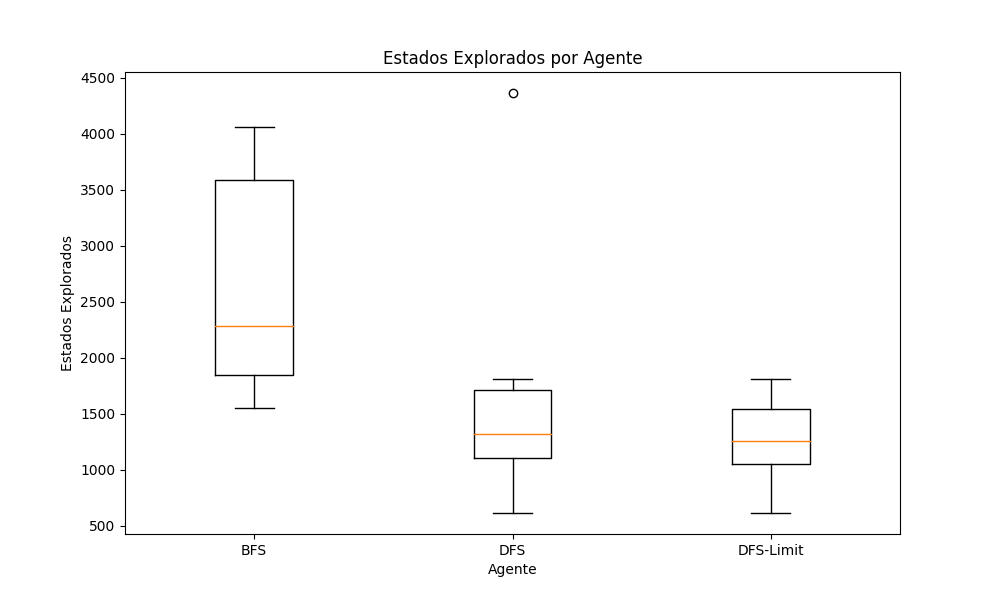
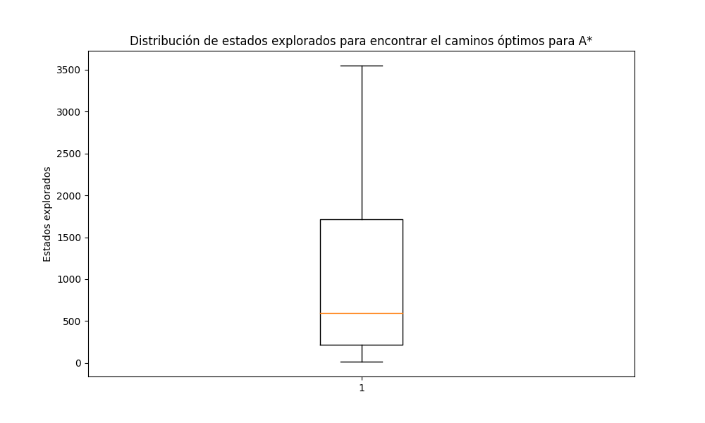

# Trabajo Práctico 4: Búsqueda Informada

## Ejercicio B
Ejecutar un total de 30 veces el algoritmo A* en un escenario aleatorio con una tasa de obstáculos del 8 por ciento, calcular la media y la desviación estándar de la cantidad de estados explorados para llegar al destino (si es que fue posible). Evaluar cada uno de los algoritmos sobre el mismo conjunto de datos generado. Presentar los resultados en un  gráfico de cajas y bigotes o boxplot. Incluya también los resultados obtenidos en el punto B del TP3 sobre búsquedas no 
informadas.

| Agente           | Estados Explorados en Promedio | Desviación Estándar |
|------------------|--------------------------------|---------------------|
| BFSAgent         | 2678.14                        | 476,85             |
| DFSAgent         | 1702.14                        | 562.58             |
| DFSLimitAgent    | 1258.67                        | 177.95             |
| A*               | 1024.42                        | 927.79             |

### Porcentaje de Entornos Resueltos
+ Porcentaje de veces que **BFSAgent** encontró la solución: 23,3.00%
+ Porcentaje de veces que **DFSAgent** encontró la solución: 23,3.00%
+ Porcentaje de veces que **DFS-LimitAgent** encontró la solución: 20.00%
+ Porcentaje de veces que **A*** encontró la solución: 86.6%

### Estados Explorados

### Estados Explorados A*

### Conclución
Aunque mi implementacion de A* explora muchos estados, tiene un porcentaje de exito muchisimo mayor que otras implementaciones. Por ende creo que es el mas adecuado para busquedas informadas.