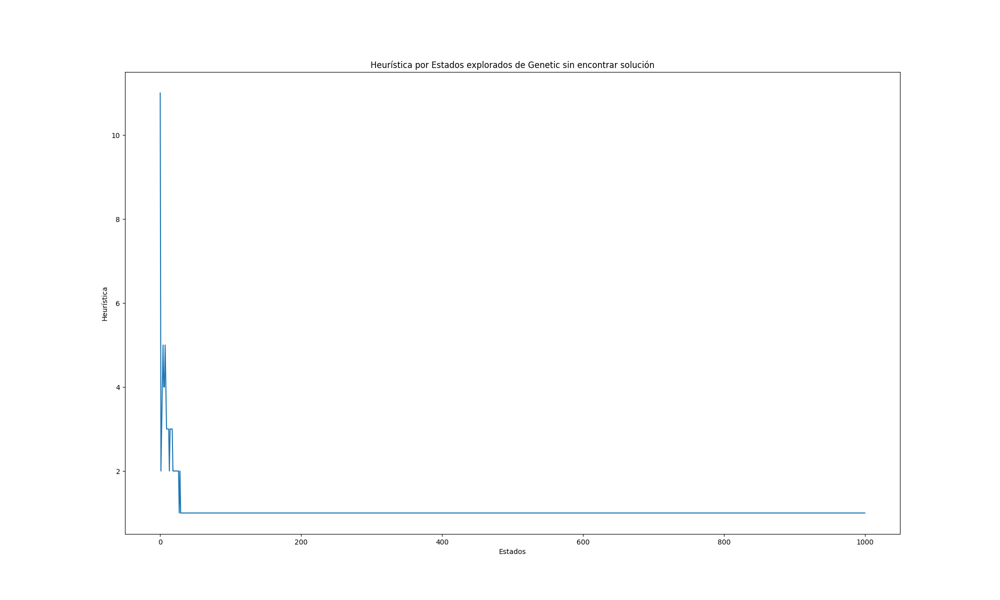

# Trabajo Práctico 5: Búsqueda Local
**Estudiante:** Cohen Ari (13672)

## Parte II
**Estrategias utilizadas para el algoritmo "Genético"**
- **Población inicial**: 100 individuos.
- **Selección**: Se utiliza seleccion proporcional, teniendo probabilidad de tomar un padre no tan optimo.
- **Cruce**: Método de cruce de 2 puntos.
- **Mutación**: Método de mutación por intercambio aleatorio de 1 o 2 intercambios.

### Ejercicio A
Ejecutar cada uno de los algoritmos implementados en la parte 1, 30 veces y calcular para el caso de 4, 8, 10, 12, 15. 
reinas:

1. El número (porcentaje) de veces que se llega a un estado de solución óptimo.

    | Tamaño del Tablero | Algoritmo           | Porcentaje de Éxito |
    |--------------------|---------------------|---------------------|
    | 4                  | Hill Climbing       | 26.66%              |
    | 4                  | Simulated Annealing | 100%                |
    | 4                  | Genetic             | 100%                |
    | 8                  | Hill Climbing       | 23.33%              |
    | 8                  | Simulated Annealing | 100%                |
    | 8                  | Genetic             | 56.66%              |
    | 10                 | Hill Climbing       | 6.66%               |
    | 10                 | Simulated Annealing | 76.66%              |
    | 10                 | Genetic             | 23.33%              |
    | 12                 | Hill Climbing       | 3.33%               |
    | 12                 | Simulated Annealing | 80%                 |
    | 12                 | Genetic             | 10%                 |
    | 15                 | Hill Climbing       | 3.33%               |
    | 15                 | Simulated Annealing | 66.6%               |
    | 15                 | Genetic             | 3.33%               |

2. El tiempo de ejecución promedio y la desviación estándar para encontrar dicha solución.

Tamaño del Tablero|Algoritmo|Avg Execution Time|Std Execution Time|
|-----------------|---------|------------------|--------------------------------|
|4| Hill Climbing|  0.011798715591430664|  0.34802289906605066|
|4| Simulated Annealing|  0.000667270024617513|  0.019719048235120634|  
|4| Genetic|  0.0011010249455769858|  0.032478070585089114| 
|8| Hill Climbing|   0.020817391077677407|  0.6140763837772353|  
|8| Simulated Annealing|  0.015824921925862632|  0.4668320043928885|  
|8| Genetic|   2.3247349818547565|  68.61557613606168| 
|10| Hill Climbing|   0.033557494481404625|  0.9898263018177865|  
|10| Simulated Annealing|  0.062147990862528486|  1.8333974463476845|  
|10| Genetic|   5.365884200731913|  158.2978908496187|  
|12| Hill Climbing|   0.04233864148457845|  1.2488230728234273|  
|12| Simulated Annealing|  0.0762205441792806|  2.2485422897653797|  
|12| Genetic|  8.298168873786926|  244.77544403925205|  
|15| Hill Climbing|   0.06935492356618246|  2.045689170192403|  
|15| Simulated Annealing|   0.14576727549235027|  4.29980339351077|  
|15| Genetic|  12.57653362751007|  370.96078493850484|

3. La cantidad de estados previos promedio y su desviación estándar por los que tuvo que pasar para llegar a una 
solución.

    | Tamaño del Tablero | Algoritmo           | Cantidad de Estados Promedio | Desviación Estándar |
    |--------------------|---------------------|------------------------------|---------------------|
    |4| Hill Climbing| 1008.0| 0.0|
    |4| Simulated Annealing|   15.4|  18.99292064119572|
    |4| Genetic|   0.0| 0.0|
    |8| Hill Climbing|   883.2| 320.3969951213004 |
    |8| Simulated Annealing|   203.1|  100.02287669362926|
    |8| Genetic|   453.2| 488.4719594535738|
    |10| Hill Climbing|  983.3333333333334| 91.28709291752769|
    |10| Simulated Annealing|   555.4|  296.4811559982674|
    |10| Genetic|   771.7666666666667| 420.7991316476334|
    |12| Hill Climbing|  988.8| 105.1627310409919|
    |12| Simulated Annealing|   543.7|  287.08044649300075|
    |12| Genetic|   905.3333333333334| 288.9844684208926|
    |15| Hill Climbing|  1117.5| 41.07919181288746|
    |15| Simulated Annealing|   729.9333333333333|  242.76552236793165|
    |15| Genetic|  970.5| 161.578154464024|

4. Generar una tabla con los resultados para cada uno de los algoritmos desarrollados y guardarla en formato .csv.

    La tabla se encuentra en el archivo [busquedas-locales-results.csv](./busquedas-locales.csv).
5. Realizar un gráfico de cajas (boxplot) que muestre la distribución de los tiempos de ejecución de cada algoritmo.
    
    

    Vista en detalle de Hill Climbing y Simulated Annealing:

    

## Ejercicio B
Para cada uno de los algoritmos, graficar la variación de la función h() a lo largo de las iteraciones. (Considerar 
solo una ejecución en particular).

El tamaño del tablero utilizado para la ejecución de los algoritmos fue de 12. 
<!-- En el caso del algoritmo genético, se utilizarón las mismas estrategias ya previamente mencionadas. -->

### **Hill Climbing**

Resultado de la ejecución:

### **Simulated Annealing**

Resultado de la ejecución:
##### - Sin encontrar solución:

##### - Con solución econtrada:

### **Genetic**

Resultado de la ejecución:
##### - Sin encontrar solución:

##### - Con solución econtrada:

### Ejercicio C
Indicar según su criterio, cuál de los tres algoritmos implementados resulta más adecuado para la solución del problema de las n-reinas. Justificar.

Tomando en cuenta la implementación propia y los resultados obtenidos, el que resulta mas adecuado es el algoritmo de **Simulated Annealing**, ya que en tiene un porcentaje de encontrar la solucion en problemas grandes mucho mayor que el algoritmo Genetico, ademas demorar bastante menos.