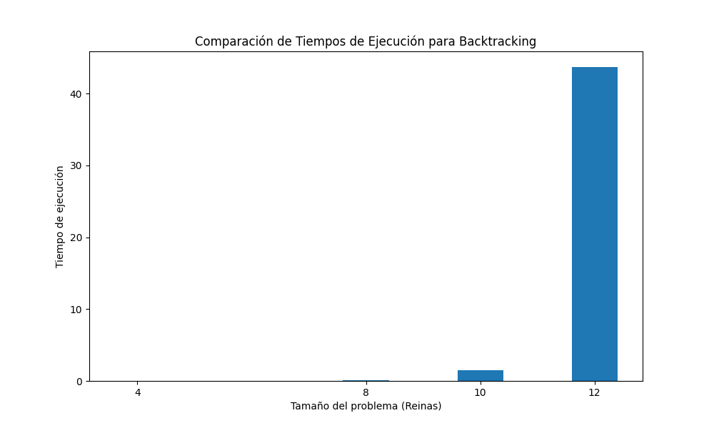
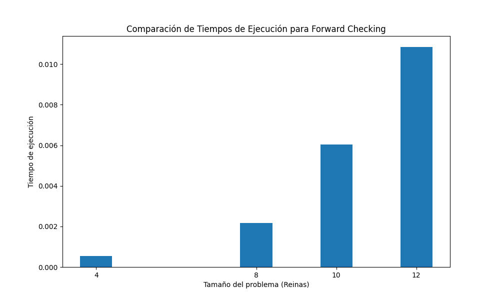
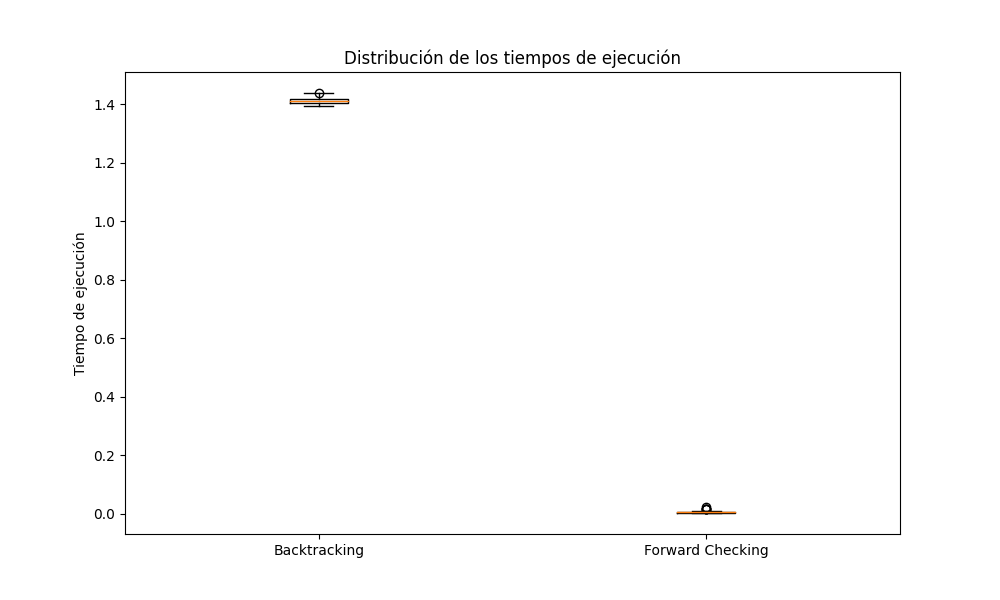
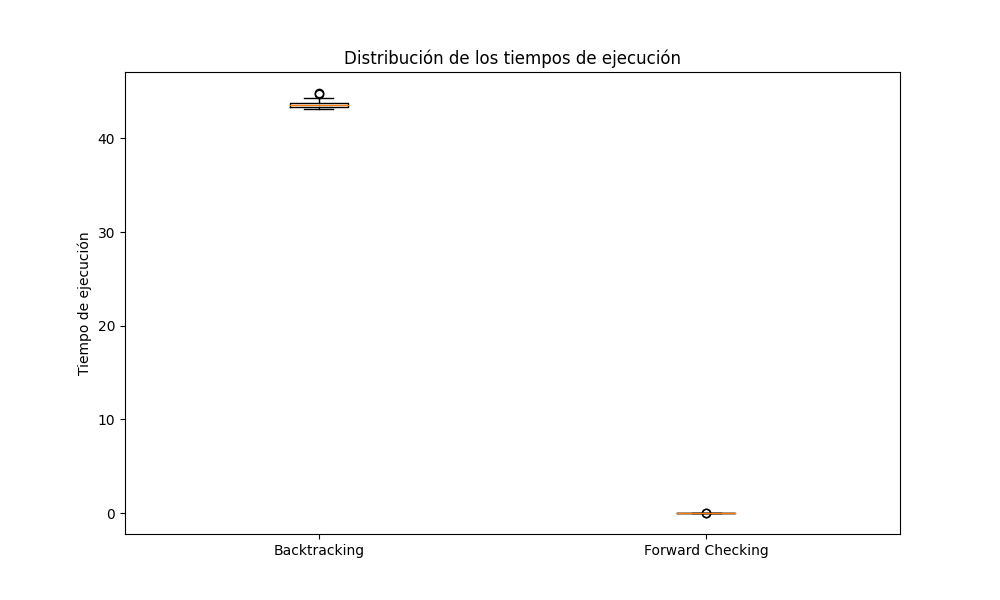
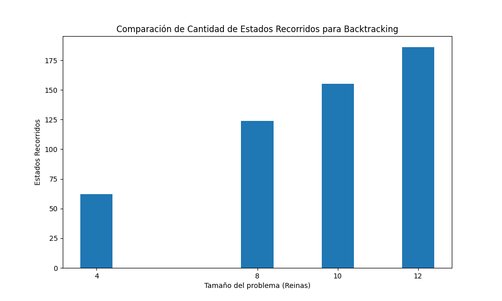
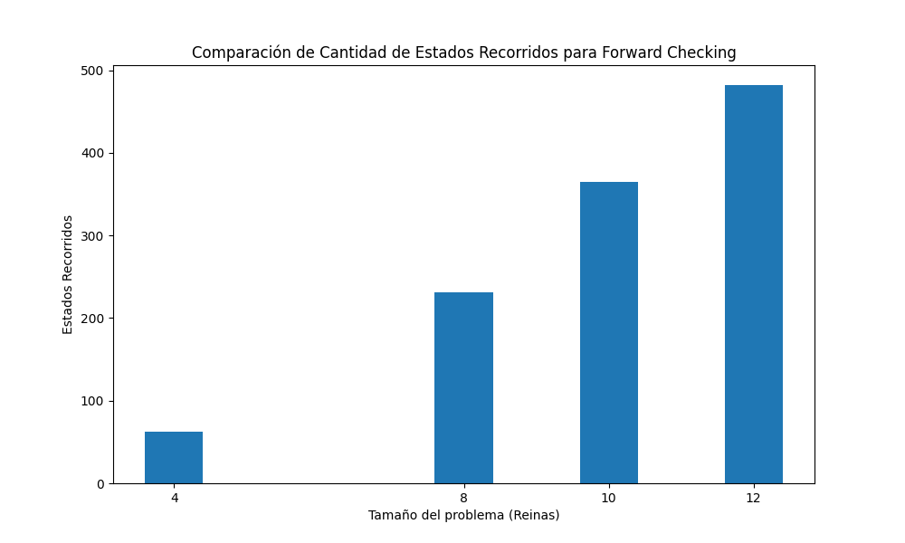

## Ejercicio 6: 
#### Implementar una solución al problema de las n-reinas utilizando una formulación CSP. 
A. Implementar una solución utilizando backtracking.
B. Implementar una solución utilizando encadenamiento hacia adelante.
C. En cada variante, calcular los tiempos de ejecución para los casos de 4, 8, 10, 12 y 15 reinas. 
D. En cada variante, calcular la cantidad de estados recorridos antes de llegar a la solución para los casos de 4, 8, 10, 12 y 15 reinas. 
E. Realizar un gráfico de cajas para los puntos C y D.

| Tamaño | Algoritmo       | Sol Found | AVG Time    | STD Time    | AVG States | STD States |
|--------|-----------------|-----------|-------------|-------------|------------|------------|
| 4      | Backtracking    | 60        | 0.0001668   | 0.0049344   | 62.0       | 35.2136    |
| 4      | Forward Checking| 60        | 0.0005338   | 0.0157529   | 62.0       | 35.2136    |
| 8      | Backtracking    | 2760      | 0.0674277   | 1.9888389   | 124.0      | 70.4273    |
| 8      | Forward Checking| 50        | 0.0021687   | 0.0639767   | 230.9333   | 121.7388   |
| 10     | Backtracking    | 21720     | 1.4737879   | 43.4705     | 155.0      | 88.0341    |
| 10     | Forward Checking| 36        | 0.0060386   | 0.1781     | 365.0      | 213.0849   |
| 12     | Backtracking    | 426000    | 43.6867254  | 1288.5733   | 186.0      | 105.6409   |
| 12     | Forward Checking| 38        | 0.0108429   | 0.3199     | 482.0      | 237.9029   |

1. **Soluciones Encontradas:** Los algoritmos Backtracking encuentran significativamente más soluciones en todos los casos en comparación con Forward Checking.

2. **Tiempo Promedio (AVG Time):** Backtracking tiende a ser más lento que Forward Checking en todos los tamaños. La diferencia en el tiempo promedio es más notable a medida que aumenta el tamaño del problema.

3. **Estados Promedio (AVG States) y Desviación Estándar de Estados (STD States):** En la mayoría de los casos, Backtracking requiere menos estados para encontrar soluciones y tiene una menor variabilidad en comparación con Forward Checking.

En resumen, Backtracking encuentra más soluciones, pero para problemas grandes se puede volver muy lento para encontrar todas las soluciones, una alternativa seria una vez encontrado un resultado terminar la ejecución.

### C - Tiempos de Ejecución

**Tabla de Comparación de Tiempos de Ejecución:**

| Tamaño | Backtracking (AVG Time) | Forward Checking (AVG Time) |
|--------|-------------------------|-----------------------------|
| 4      | 0.0001668               | 0.0005338                   |
| 8      | 0.0674277               | 0.0021687                   |
| 10     | 1.4737879               | 0.0060386                   |
| 12     | 43.6867254              | 0.0108429                   |

**Para Tamaño 10:**

**Para Tamaño 12:**

### D - Estados Recorridos

**Tabla de Comparación de Cantidad de Estados Recorridos:**

| Tamaño | Backtracking (AVG States) | Forward Checking (AVG States) |
|--------|---------------------------|-------------------------------|
| 4      | 62.0                      | 62.0                          |
| 8      | 124.0                     | 230.9333                      |
| 10     | 155.0                     | 365.0                         |
| 12     | 186.0                     | 482.0                         |

