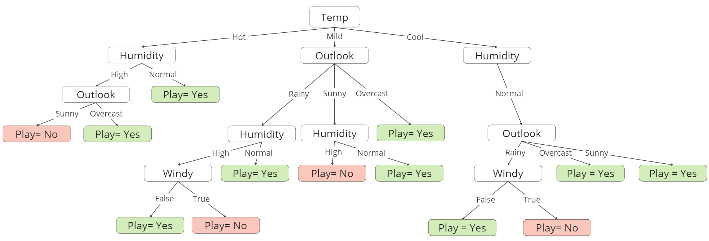

# Parte C
## 1. Implementar un algoritmo para construir un árbol de decisión de acuerdo al pseudo-código provisto en AIMA

#### Arbol resultado:

## 2. Investigar sobre las estrategias de los árboles de decisión para datos de tipo real.

#### Atributos de valor continuo:
Si se esta tratando de predecir un valor numerico, se necesita usar un arbol de regresion ne vez de un arbol de clasificación. Un arbol de regresion tiene en cada hoja una funcion de un subset de atributos numericos. Por ejemplo si se busca predecir el precio de un apartamento nos podemos encontrar con una funcion para un departamento de 2 dormitorios de la siguiente forma: metros cuadrados, cantidad de baños, ingreso promedio del vecindario. El algoritmo de aprendizaje debe decidir cuándo dejar de dividir y comenzar a aplicar la regresión lineal sobre los atributos.

Fuente: Artificial Intelligence A Modern Approach(3rd Edition)
